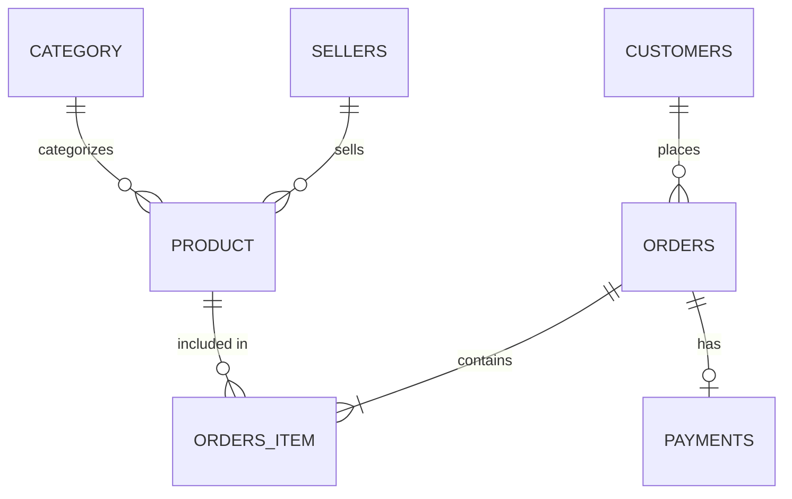

<div align="center">

# 🛒 Zonik Marketplace

### Высокопроизводительное ядро базы данных для современной e-commerce платформы

[](https://www.postgresql.org/)
[](https://www.python.org/)
[](https://www.docker.com/)
[](LICENSE)

*Архитектурное решение для управления мультивендорным маркетплейсом с аналитическим слоем и автоматизированной бизнес-логикой*

[📋 О проекте](#-о-проекте) •
[🚀 Быстрый старт](#-быстрый-старт) •
[📊 Модель данных](#-модель-данных) •
[💡 Ключевые фичи](#-ключевые-фичи) •
[📈 Аналитика](#-аналитика) •
[🛠 Технологии](#-технологии)

</div>

---

## 📋 О проекте

**Zonik** — это не просто набор SQL-скриптов. Это полноценное ядро маркетплейса, спроектированное с учётом реальных бизнес-требований современного e-commerce.

### 🎯 Проблема, которую решает проект

Малый и средний бизнес часто начинает с Excel-таблиц для учёта товаров и заказов. При масштабировании это приводит к:
- ❌ Потере целостности данных
- ❌ Отсутствию истории изменений цен
- ❌ Невозможности анализировать эффективность продавцов
- ❌ Ошибкам в остатках при одновременных заказах

### ✅ Решение

**Zonik** предоставляет нормализованную схему из **8 сущностей**, покрывающую полный цикл:
`Клиент → Товар → Корзина → Заказ → Оплата`

---

## 🚀 Быстрый старт

### Предварительные требования

- Docker и Docker Compose
- PostgreSQL 15+ (опционально, если без Docker)
- Python 3.10+ (для CLI-приложения)

### Установка за 30 секунд

```bash
# 1. Клонируем репозиторий
git clone https://github.com/твой-username/Zonik-Marketplace-DB.git
cd Zonik-Marketplace-DB

# 2. Поднимаем базу данных с тестовыми данными
docker-compose up -d

# 3. Проверяем, что всё работает
docker exec -it zonik_db psql -U postgres -d zonik_marketplace -c "\dt"
```

### Запуск CLI-приложения

```bash
# Устанавливаем зависимости
pip install -r requirements.txt

# Запускаем консольный интерфейс маркетплейса
python app/main.py
```

---

## 📊 Модель данных

### Логическая схема


### Физическая ER-диаграмма


### Описание сущностей

| Таблица | Назначение | Ключевые особенности |
|---------|------------|---------------------|
| `customers` | Профили покупателей | Уникальный телефон, email |
| `sellers` | Продавцы/магазины | Рейтинг с CHECK-ограничением |
| `category` | Категории товаров | Иерархическая структура |
| `product` | Карточки товаров | Связь с продавцом и категорией |
| `orders` | Заголовки заказов | Автоматическая дата создания |
| `orders_item` | Позиции заказа | **Составной первичный ключ** |
| `payments` | Транзакции оплаты | CHECK на методы и статусы |

### Связи и ограничения



---

## 💡 Ключевые фичи

### 🧠 Интеллектуальные триггеры

База данных **сама следит** за целостностью данных:

```sql
-- Автоматическое списание остатков при создании заказа
CREATE TRIGGER trg_update_stock
AFTER INSERT ON orders_item
FOR EACH ROW EXECUTE FUNCTION update_stock();
```

### 📦 Хранимые процедуры

Сложная бизнес-логика инкапсулирована в процедуры:

```sql
-- Создание заказа одним вызовом
CALL make_order(
    p_customer_id := 1,
    p_product_id  := 5,
    p_quantity    := 2
);
```

### 🔒 Ограничения целостности

| Тип ограничения | Пример |
|----------------|--------|
| `CHECK` | `Stock_Quantity >= 0` |
| `CHECK` | `Rating BETWEEN 0 AND 5` |
| `CHECK` | `Payment_Method IN ('При получении', 'Картой онлайн', 'СБП')` |
| `FOREIGN KEY` | `ON DELETE CASCADE` для заказов |
| `UNIQUE` | Телефон клиента, Email |

---

## 📈 Аналитика

Проект включает готовые аналитические запросы для дашбордов:

### 1. Витрина товаров (для клиента)

```sql
SELECT 
    p.Product_Name,
    s.Store_Name,
    s.Rating,
    p.Price,
    CASE 
        WHEN p.Stock_Quantity = 0 THEN '🔴 Нет в наличии'
        WHEN p.Stock_Quantity < 5 THEN '🟡 Заканчивается'
        ELSE '🟢 В наличии'
    END AS Availability
FROM product p
JOIN sellers s ON p.Sellers_ID = s.Sellers_ID
WHERE s.Rating >= 4.0
ORDER BY s.Rating DESC, p.Price ASC;
```

### 2. Рейтинг продавцов по выручке

```sql
SELECT 
    s.Store_Name,
    COUNT(DISTINCT o.Order_ID) AS Total_Orders,
    COALESCE(SUM(o.Total_Amount), 0) AS Revenue,
    RANK() OVER (ORDER BY SUM(o.Total_Amount) DESC) AS Place
FROM sellers s
LEFT JOIN product p ON s.Sellers_ID = p.Sellers_ID
LEFT JOIN orders_item oi ON p.Product_ID = oi.Product_ID
LEFT JOIN orders o ON oi.Order_ID = o.Order_ID
GROUP BY s.Sellers_ID, s.Store_Name
ORDER BY Revenue DESC;
```

### 3. ABC-анализ товаров

```sql
WITH product_sales AS (
    SELECT 
        p.Product_ID,
        p.Product_Name,
        COALESCE(SUM(oi.Quantity * oi.Price_At_Time), 0) AS Revenue
    FROM product p
    LEFT JOIN orders_item oi ON p.Product_ID = oi.Product_ID
    GROUP BY p.Product_ID, p.Product_Name
),
ranked AS (
    SELECT *,
        SUM(Revenue) OVER (ORDER BY Revenue DESC) * 100.0 / 
        SUM(Revenue) OVER () AS Cumulative_Percent
    FROM product_sales
    WHERE Revenue > 0
)
SELECT 
    Product_Name,
    Revenue,
    CASE 
        WHEN Cumulative_Percent <= 80 THEN 'A (Топ-продажи)'
        WHEN Cumulative_Percent <= 95 THEN 'B (Средние продажи)'
        ELSE 'C (Низкие продажи)'
    END AS ABC_Category
FROM ranked;
```

---

## 🛠 Технологии

<div align="center">

| Категория | Технология | Обоснование |
|-----------|-----------|-------------|
| **СУБД** | PostgreSQL 15+ | ACID, JSONB, оконные функции |
| **Язык** | PL/pgSQL | Хранимые процедуры и триггеры |
| **Бэкенд** | Python 3.10+ | CLI-интерфейс, psycopg2 |
| **Контейнеризация** | Docker + Compose | Изолированное окружение |
| **Визуализация** | Mermaid, dbdiagram.io | ER-диаграммы в коде |
| **Контроль версий** | Git + GitHub | Семантическое версионирование |

</div>

---

## 🧪 Тестирование

Запуск тестовых сценариев:

```bash
# Проверка триггеров (создание заказа должно уменьшить остаток)
docker exec -i zonik_db psql -U postgres -d zonik_marketplace < tests/test_queries.sql
```

---

## 📂 Структура проекта

```
.
├── database/           # Все SQL-скрипты
│   ├── 01_schema.sql   # DDL (CREATE TABLE)
│   ├── 02_seed_data.sql # Тестовые данные
│   ├── 03_functions_triggers.sql # Процедуры и триггеры
│   ├── 04_views.sql    # Представления
│   └── 05_analytics_queries.sql # Аналитика
├── app/                # Python CLI
├── docs/               # Диаграммы и документация
└── tests/              # SQL-тесты
```

---

## 🎓 Академический контекст

Проект разработан в рамках курса **«Проектирование баз данных»** и демонстрирует:

- ✅ Нормализацию до 3НФ
- ✅ Работу с ограничениями целостности
- ✅ Использование транзакций и ACID-свойств
- ✅ Оптимизацию запросов с индексами
- ✅ Создание хранимых процедур и триггеров
- ✅ Проектирование архитектуры многопользовательской системы

---

## 🤝 Вклад в проект

Хотите улучшить Zonik?

1. Форкните репозиторий
2. Создайте ветку: `git checkout -b feature/amazing-feature`
3. Закоммитьте изменения: `git commit -m 'Add amazing feature'`
4. Запушьте: `git push origin feature/amazing-feature`
5. Откройте Pull Request

---

## 📄 Лицензия

Распространяется под лицензией MIT. См. файл [LICENSE](LICENSE).

---

## 📞 Контакты

**Автор:** [Твоё Имя]

[](https://github.com/твой-username)
[](https://t.me/твой-telegram)
[](mailto:твой-email@gmail.com)

---

<div align="center">

### ⭐ Если проект оказался полезным, поставьте звезду!

</div>
