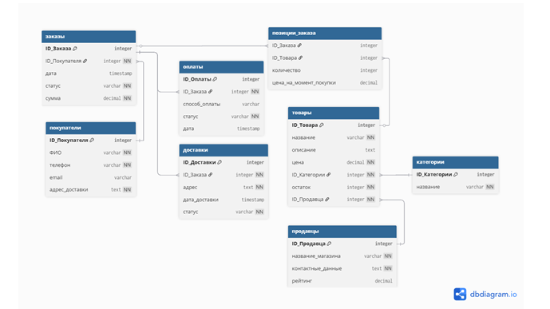
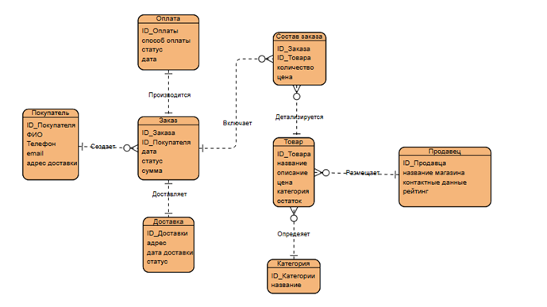

<div align="center">

# 🛒 Zonik Marketplace

### Высокопроизводительное ядро базы данных для современной e-commerce платформы

[](https://www.postgresql.org/)
[](https://www.python.org/)
[](https://www.docker.com/)

*Архитектурное решение для управления мультивендорным маркетплейсом с аналитическим слоем и автоматизированной бизнес-логикой*

[ О проекте](#-о-проекте) •
[ Быстрый старт](#-быстрый-старт) •
[ Модель данных](#-модель-данных) •
[ Ключевые фичи](#-ключевые-фичи) •
[ Аналитика](#-аналитика) •
[Технологии](#-технологии)

</div>

---

##  О проекте

**Zonik** — это не просто набор SQL-скриптов. Это полноценное ядро маркетплейса, спроектированное с учётом реальных бизнес-требований современного e-commerce.

###  Проблема, которую решает проект

Малый и средний бизнес часто начинает с Excel-таблиц для учёта товаров и заказов. При масштабировании это приводит к:
- ❌ Потере целостности данных
- ❌ Отсутствию истории изменений цен
- ❌ Невозможности анализировать эффективность продавцов
- ❌ Ошибкам в остатках при одновременных заказах

### ✅ Решение

**Zonik** предоставляет нормализованную схему из **8 сущностей**, покрывающую полный цикл:
`Клиент → Товар → Корзина → Заказ → Оплата → Доставка`

---

## Быстрый старт

### Через Docker (рекомендуется)

```bash
# 1. Клонируем репозиторий
git clone https://github.com/твой-username/Zonik-Marketplace.git
cd Zonik-Marketplace

# 2. Запускаем всё одной командой
docker-compose up -d

# 3. Ждём 10-15 секунд (инициализация БД)

# 4. Запускаем приложение
docker-compose run app
```

Готово! Ты в главном меню Zonik.

###  Локальный запуск (без Docker)

#### Предварительные требования
- PostgreSQL 18
- Python 3.12

#### Установка

```bash
# 1. Клонируем репозиторий
git clone https://github.com/Beaulo0o/Zonik
cd Zonik-Marketplace

# 2. Создаём виртуальное окружение
python -m venv venv

# 3. Активируем (Windows)
venv\Scripts\activate

# 4. Устанавливаем зависимости
pip install -r requirements.txt

# 5. Копируем .env.example → .env и вписываем свои настройки БД
cp .env.example .env

# 6. Создаём базу данных и выполняем SQL-скрипты в PostgreSQL:
#    - database/01_schema.sql
#    - database/02_seed_data.sql
#    - database/03_functions_triggers.sql
#    - database/04_views.sql

# 7. Запускаем приложение
python -m app.main
```

---

##  Модель данных

### Логическая схема



### Физическая ER-диаграмма



### Описание сущностей

| Таблица | Назначение | Ключевые особенности |
|---------|------------|---------------------|
| `customers` | Профили покупателей | Уникальный телефон, email |
| `sellers` | Продавцы/магазины | Рейтинг с CHECK-ограничением |
| `category` | Категории товаров | Справочник |
| `product` | Карточки товаров | Связь с продавцом и категорией |
| `orders` | Заголовки заказов | Автоматическая дата создания |
| `orders_item` | Позиции заказа | **Составной первичный ключ** |
| `payments` | Транзакции оплаты | CHECK на методы и статусы |
| `delivery` | Доставка заказов | CHECK на статусы доставки |


---

##  Ключевые фичи

###  Интеллектуальные триггеры

База данных **сама следит** за целостностью:

```sql
-- Автоматическое списание остатков при создании заказа
CREATE TRIGGER trg_update_stock
AFTER INSERT ON orders_item
FOR EACH ROW EXECUTE FUNCTION update_stock_after_order();

-- Автоматический пересчёт суммы заказа
CREATE TRIGGER trg_recalc_order_total_insert
AFTER INSERT ON orders_item
FOR EACH ROW EXECUTE FUNCTION recalc_order_total();
```

###  Две роли пользователей

| Роль | Возможности |
|------|-------------|
| **Покупатель** | Просмотр каталога, оформление заказа с корзиной, история своих заказов |
| **Продавец** | Добавление товаров, управление остатками, просмотр заказов со своими товарами |

###  Умная корзина

- Добавление нескольких товаров
- Автоматическое объединение одинаковых позиций
- Проверка наличия перед оформлением
- Выбор способа оплаты и адреса доставки

###  Готовые представления (VIEW)

| VIEW | Назначение |
|------|------------|
| `v_product_full` | Товары с продавцами и статусом наличия |
| `v_orders_full` | Заказы с полной информацией |
| `v_seller_stats` | Статистика по продавцам |
| `v_low_stock_products` | Товары с низким остатком |
| `v_daily_revenue` | Выручка по дням |

---

##  Аналитика

Проект включает готовые аналитические запросы:

### 1. Витрина товаров (для клиента)

```sql
SELECT * FROM v_product_full WHERE availability = 'В наличии';
```

### 2. Рейтинг продавцов по выручке

```sql
SELECT * FROM v_seller_stats ORDER BY total_revenue DESC;
```

### 3. ABC-анализ товаров

```sql
WITH product_sales AS (
    SELECT 
        p.Product_Name,
        COALESCE(SUM(oi.Quantity * oi.Price_At_Time), 0) AS Revenue
    FROM Product p
    LEFT JOIN Orders_Item oi ON p.Product_ID = oi.Product_ID
    GROUP BY p.Product_ID, p.Product_Name
),
ranked AS (
    SELECT *,
        SUM(Revenue) OVER (ORDER BY Revenue DESC) * 100.0 / SUM(Revenue) OVER () AS Cumulative_Percent
    FROM product_sales
    WHERE Revenue > 0
)
SELECT 
    Product_Name,
    Revenue,
    CASE 
        WHEN Cumulative_Percent <= 80 THEN 'A (Топ)'
        WHEN Cumulative_Percent <= 95 THEN 'B (Средние)'
        ELSE 'C (Низкие)'
    END AS ABC_Category
FROM ranked;
```

Больше запросов в файле `database/05_analytics_queries.sql`.

---

##  Технологии

| Категория | Технология | Обоснование |
|-----------|-----------|-------------|
| **СУБД** | PostgreSQL 18 | ACID, JSONB, оконные функции |
| **Язык БД** | PL/pgSQL | Хранимые процедуры и триггеры |
| **Бэкенд** | Python 3.12| CLI-интерфейс, psycopg2 |
| **Контейнеризация** | Docker + Compose | Изолированное окружение |
| **Контроль версий** | Git + GitHub | Семантическое версионирование |

---

##  Структура проекта

```
.
├── Dockerfile              # Сборка Python-приложения
├── docker-compose.yml      # Оркестрация контейнеров
├── .dockerignore           # Исключения для Docker
├── .env.example            # Шаблон переменных окружения
├── .gitignore              # Исключения для Git
├── requirements.txt        # Python-зависимости
├── README.md               # Документация
│
├── database/               # SQL-скрипты
│   ├── 01_schema.sql       # DDL (CREATE TABLE)
│   ├── 02_seed_data.sql    # Тестовые данные
│   ├── 03_functions_triggers.sql # Процедуры и триггеры
│   ├── 04_views.sql        # Представления
│   └── 05_analytics_queries.sql # Аналитика
│
├── app/                    # Python-приложение
│   ├── main.py             # Основной код
│   ├── db_config.py        # Конфигурация БД
│   └── setup.py            # Утилита создания БД
│
└── docs/                   # Документация
    ├── logical_model.png   # Логическая схема
    └── er_diagram.png      # ER-диаграмма
```

---

##  Тестирование

### Проверка триггеров

```bash
# Подключаемся к БД
docker exec -it zonik_db psql -U postgres -d zonik

# Смотрим триггеры
SELECT trigger_name, event_object_table FROM information_schema.triggers;
```

### Проверка VIEW

```sql
SELECT * FROM v_seller_stats;
SELECT * FROM v_low_stock_products;
SELECT * FROM v_daily_revenue;
```

---

## Академический контекст

Проект разработан в рамках курса **«Проектирование баз данных»** и демонстрирует:

- ✅ Нормализацию до 3НФ
- ✅ Работу с ограничениями целостности (CHECK, FOREIGN KEY, UNIQUE)
- ✅ Использование транзакций и ACID-свойств
- ✅ Оптимизацию запросов с индексами
- ✅ Создание хранимых процедур и триггеров
- ✅ Проектирование архитектуры многопользовательской системы
- ✅ Контейнеризацию приложения (Docker)

---
